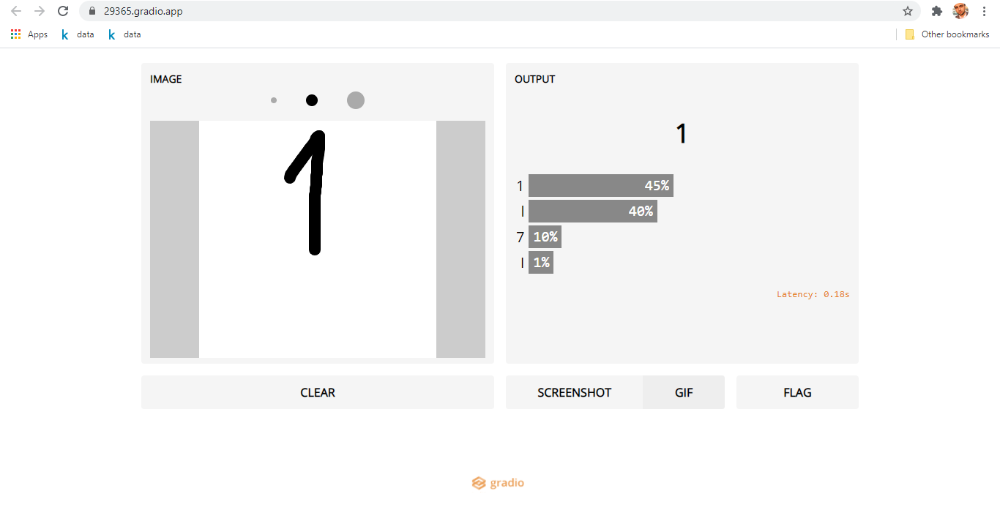

# Educational Application using Machine and Deep Learning
### GOAL : EMNIST Handwritten Character Recognition  

<!--  -->



A [Flask](http://flask.pocoo.org/) web app for handwritten character recognition (0-9,A-Z,a-z) using a convolutional neural network. The model was trained on the EMNIST dataset from [Kaggle](https://www.kaggle.com/crawford/emnist) using the [Keras API](https://github.com/fchollet/keras).

# Handwritten-Text-Recognition-System
Handwritten Text Recognition System using Convolutional Neural Network.           
Dataset - EMNIST Byclass: 814,255 characters and 62 unbalanced classes.       
GUI : Gradio     
Final_Project_TextRecognition.ipynb file:
1. Importing libraries and Dataset
2. Visualization
3. Reshaping & one Hot Encoding
4. Model (CNN Model)
5. Evaluate on Model & Predictions  

Final_GUI.ipynb file:
1. Importing gradio, model.json and model.h5 files.
2. GUI using Gradio tool


## To Run the Flask App
Clone or download this repository. Then open shell prompt and navigate to this repository. Run the following command:

```
$ python app.py
```

## Usage for Running the Model

Navigate to the `model-new` Folder. 

### Get the dataset from Kaggle
Navigate to `model-new/input` Folder and unzip the dataset

### Run the Jupyter Notebook for Retraining
Run the `model.ipynb` to retrain the model.
